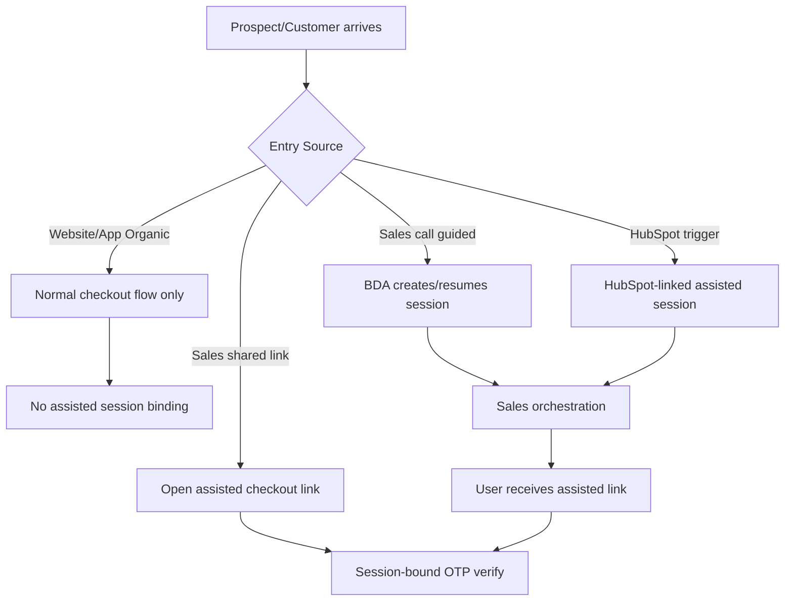
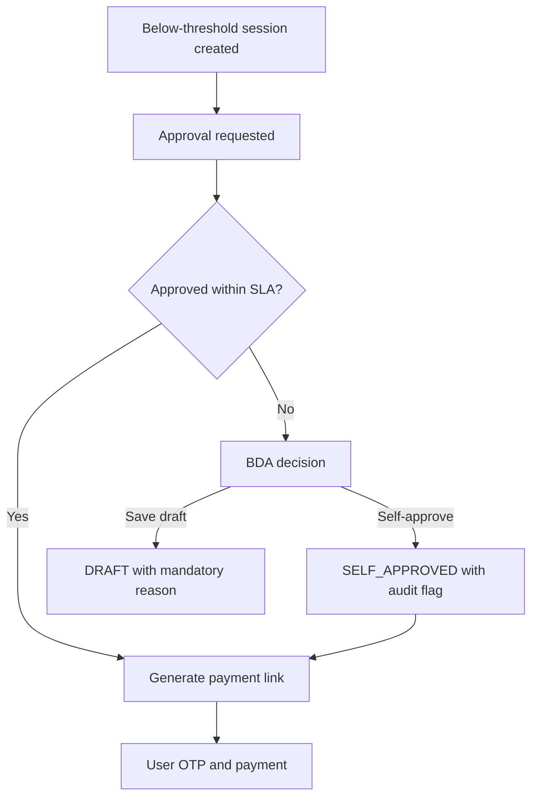
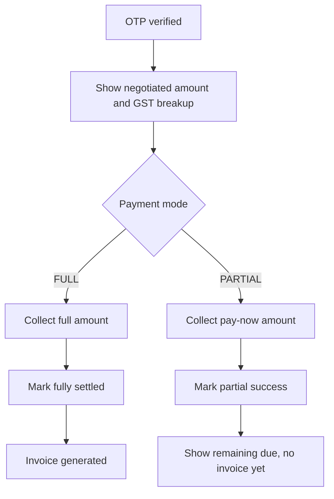

# Prosperr Checkout Suite (Assisted Checkout UI)

Frontend prototype for Prosperr's assisted payment checkout journeys:

- customer checkout with OTP and payment flow
- sales/BDA assisted session creation and monitoring
- supervisor approval workflows for below-threshold pricing
- renewal and dependent-ready UX paths
- GST-inclusive negotiated pricing with tax breakup display
- partial payment flow (pay-now + remaining) with invoice-after-full-settlement behavior

The canonical product/backend source-of-truth for this repo is:

- `docs/assisted-checkout-flow-definition.md`

## Tech stack

- React + TypeScript + Vite
- Tailwind CSS + shadcn/ui
- Framer Motion (transitions/UX feedback)

## Local setup

```bash
npm install
npm run dev
```

App runs at the Vite default URL (typically `http://localhost:8080` or `http://localhost:5173` depending on your local config).

## Key routes

- `/` - home
- `/checkout` - customer/organic checkout
- `/checkout/session/:sessionId`
- `/checkout/session/:sessionId/:mobile` - assisted customer flow
- `/checkout/sales` - sales portal
- `/checkout/sales/new-session` - create assisted session
- `/checkout/sales/session/:sessionId` - session detail and approval state
- `/checkout/sales/renewal` - renewal flow

## Mock login roles (UI-only)

Sales login is currently mocked for role switching:

- supervisor emails: `a@prosperr.io` ... `f@prosperr.io`
- any other email logs in as BDA

Password is not validated in mock mode.

## NPM scripts

- `npm run dev` - start dev server
- `npm run build` - production build
- `npm run preview` - preview built app

## Current status

- UI aligned to assisted checkout flow definitions in sectioned doc
- backend integration points are represented via mock data/state
- approval history, draft/self-approval handling, and session-state messaging are included in UI behavior
- negotiated amounts are treated as GST-inclusive in the UI
- CGST/SGST/taxable breakdown is shown for negotiated deals
- partial payment can be configured from sales side and reflected on customer side
- invoice messaging is gated until full settlement

## Core flowcharts

Reference source: `docs/assisted-checkout-flow-definition.md`.

### Universal entry map



### Approval timeout branch



### Full vs partial settlement



## Screenshots (add assets)

- Place images under `docs/assets/screenshots/`.
- Recommended files:
  - `sales-new-session-gst-partial.png`
  - `approval-queue-and-history.png`
  - `customer-checkout-tax-breakup.png`
  - `partial-payment-success.png`
  - `terminal-states-draft-expired-rejected.png`
- Embed example:

```md

```

## Demo videos (add links/files)

- Store videos under `docs/assets/videos/` or link external recordings.
- Suggested clips:
  - `sales-assisted-journey.mp4` (`create session -> approval -> share link`)
  - `customer-partial-to-full-settlement.mp4` (`OTP -> partial pay -> remaining due -> full settlement expectation`)
- Include timestamp notes in README for key moments (ex: `00:35 approval timeout`, `01:20 partial success state`).

## API contract highlights

See:

- `docs/assisted-checkout-flow-definition.md` section 6 (Data Contract)
- `docs/assisted-checkout-flow-definition.md` section 7 (API Surface)

Pricing fields (GST-inclusive negotiation):

- `negotiatedAmount` (gross, GST-inclusive)
- `taxableAmount`
- `cgstAmount`
- `sgstAmount`
- `gstAmount`

Payment fields (partial/full):

- `paymentMode` (`FULL|PARTIAL`)
- `payNowAmount`
- `remainingAmount`
- `isFullySettled`
- `invoiceGenerated`

Binding rule:

- Invoice is generated only after full settlement.

## Demo scenarios (QA/UAT)

### Scenario A: GST-inclusive negotiated amount

- Plan: 12,000
- Negotiated amount (gross): 7,000
- Expected taxable: 5,932.20
- Expected CGST: 533.90
- Expected SGST: 533.90

### Scenario B: Partial payment

- Negotiated amount: 7,000
- Pay now: 2,000
- Remaining: 5,000
- Expected UI state after first success: "remaining due visible", "invoice not generated"

### Scenario C: Below-threshold with approval

- Create a below-threshold deal in sales flow
- If approved: link generation continues
- If timeout:
  - draft path requires reason, or
  - self-approve path is allowed with audit flag

## Documentation gaps still open

- Add real screenshots and video files to `docs/assets/`.
- Add links to actual recordings (Loom/Drive) if binaries are not committed.
- Optional: add architecture sequence diagrams as exported SVG for Confluence reuse.
