# Assisted Checkout - Detailed Flow Definition (Frontend First, Backend-Ready)

This file is the editable source-of-truth for:

1. Current and target frontend flow behavior, and  
2. Backend/API/DB design guidance for upcoming implementation in:
   - `/Users/thilaks/Desktop/Prosperr_repos/backend/prosperr-apis`

---

## 0) High-Level Split (Must Stay)

The full product flow is split into three responsibility views:

1. **User Side**
2. **Sales Side**
3. **Sales + Supervisor Side**

Every scenario must be described using these axes:

- **Price Range talked** (full, within threshold, below threshold)
- **Customer Type** (new user vs renewal)
- **Source** (website / hubspot-linked / sales-portal initiated)

---

## 1) Common Vocabulary (Authoritative Definitions)

This section defines canonical terms used by frontend, backend, and DB.

### 1.1 Roles and Responsibilities

- `USER`: end customer/prospect paying via checkout.
- `BDA`: sales rep creating/handling assisted sessions.
- `SUPERVISOR` (CMS): can do all BDA actions + approval decisions + assignment.
- `SYSTEM`: backend services (`prosperr-apis`, `UPS`, cron jobs, retry workers).

### 1.2 Channel and Source Types

- `ORGANIC`: user came from website/app directly. **Must not be forced into assisted session flow.**
- `HUBSPOT`: lead/session initiated or linked via HubSpot identifiers.
- `SALES_PORTAL`: manually created from sales portal.

### 1.3 Customer Type

- `NEW_USER`
- `RENEWAL`

### 1.4 Pricing Buckets

- `FULL_PRICE`: payable equals standard negotiated/list target for that flow.
- `WITHIN_THRESHOLD`: payable >= plan threshold floor and below full.
- `BELOW_THRESHOLD`: payable < threshold floor; approval required.

### 1.5 Session Terms

- `ASSISTED_SESSION`: tracked sales-linked payment journey.
- `ACTIVE_SESSION`: non-terminal session within validity window (default 24h).
- `TERMINAL_SESSION`: `PAYMENT_COMPLETED`, `FAILED`, `EXPIRED`, `DRAFT`, `REJECTED`.
- `LINK_VERSION`: generated payment-link revision (`v1`, `v2`, ...).

### 1.6 Frontend Routes (Current)

- Home: `/`
- Customer:
  - `/checkout`
  - `/checkout/session/:sessionId`
  - `/checkout/session/:sessionId/:mobile`
- Sales:
  - `/checkout/sales`
  - `/checkout/sales/new-session`
  - `/checkout/sales/session/:sessionId`
  - `/checkout/sales/renewal`

---

## 2) USER SIDE - Product Contract

### 2.1 Entry Rules

- Organic: user uses normal checkout flow (no assisted session dependency).
- Assisted: user opens session-bound link from BDA (with optional mobile prefill).
- User can reopen the same valid session link until terminal/expired.

### 2.2 User Journey (Assisted)

1. Verify mobile (`OTP required before payment`).
2. Review plan, customer details, renewal/dependent details.
3. Optionally apply coins (**user side only**).
4. Pay via session link.
5. Receive success/failure status and next-step messaging.

### 2.3 User Permissions

- Allowed:
  - OTP verification,
  - payment attempt/retry via valid link,
  - view details and dependents,
  - coins apply toggle (where eligible).
- Not allowed:
  - edit payable amount/price/approval policy fields,
  - edit sales-owned customer profile fields directly.

### 2.4 User-Facing Messaging Requirements

- If session `DRAFT`: show draft reason and escalation guidance.
- If session `EXPIRED`: show sales/support contact path.
- If `SELF_APPROVED`: no panic copy; standard payment flow with internal audit flag only.

---

## 3) SALES SIDE - Product Contract

### 3.1 Sales Objectives

Sales portal must let BDA quickly:

- create/resume correct session type (`NEW_USER` vs `RENEWAL`),
- understand threshold/approval requirement,
- share payment link,
- monitor payment state and history.

### 3.2 New User Canonical Scenarios

#### A) Full Price

- BDA can guide user to standard website checkout.
- Optional assisted tracking can exist by policy, but no approval gate.

#### B) Within Threshold

- Session can be HubSpot-linked or sales-created.
- No approval required.
- Payment status should sync via backend tracked path.

#### C) Below Threshold

- Assisted session required.
- Approval required before first link generation.
- Timeout branch: draft (with reason) or self-approval (flagged).

### 3.3 Sales Guardrails

- Existing-customer lookup on mobile is mandatory.
- If existing active customer found:
  - recommend renewal path,
  - allow continue-as-new only with override reason.
- One active session per prospect/mobile invariant (enforced backend-side).

### 3.4 Renewal Inputs

- Start date anchor: existing expiry date.
- End date: default + policy-based edit.
- Custom validity requires explicit audit note.
- Coins are **not** a sales form control; coins are user-side at checkout.

---

## 4) SALES + SUPERVISOR SIDE - Governance Contract

### 4.1 Access Model

- Supervisor can view all BDA session data within scope and act on approvals.
- Approval queue and history are integrated into same portal surface.

### 4.2 Approval Policy

- Triggered only for `BELOW_THRESHOLD` pricing.
- Any supervisor from approver pool can decide.
- Decisions:
  - `APPROVED`,
  - `REJECTED` (reason mandatory),
  - timeout branch to BDA actions.

### 4.3 Timeout Policy

- Hard timeout window: 3 minutes.
- BDA options:
  - `SAVE_DRAFT` (reason mandatory),
  - `SELF_APPROVE` (audit + compliance flag).

### 4.4 History and Audit Visibility

Both BDA and Supervisor must view:

- who approved/rejected/self-approved,
- decision reason,
- link generation attempts/versions,
- payment state transitions,
- HubSpot sync result (if linked).

---

## 5) Decision Matrix (Binding Rules)

| Customer Type | Price Band | Entry Source | Approval | Allowed Action |
|---|---|---|---:|---|
| NEW_USER | FULL_PRICE | Website/App | No | Normal checkout |
| NEW_USER | FULL_PRICE | Sales/HubSpot | No | Assisted optional |
| NEW_USER | WITHIN_THRESHOLD | HubSpot/Sales | No | Assisted tracked |
| NEW_USER | BELOW_THRESHOLD | Sales/HubSpot | Yes | Approval flow required |
| RENEWAL | FULL_PRICE | Sales/HubSpot | No* | Assisted tracked |
| RENEWAL | WITHIN_THRESHOLD | Sales/HubSpot | No* | Assisted tracked |
| RENEWAL | BELOW_THRESHOLD | Sales/HubSpot | Yes | Approval flow required |

`No*` means configurable override by future policy.

Additional binding rules:

- One active assisted session per prospect/mobile.
- Price cannot be edited post approval decision.
- Session validity defaults to 24h unless explicit policy override.

---

## 6) Data Contract (Frontend <-> Backend)

### 6.1 Session Status Enum (Recommended)

- `INITIATED`
- `OTP_SENT`
- `OTP_VERIFIED`
- `AWAITING_APPROVAL`
- `APPROVED`
- `REJECTED`
- `SELF_APPROVED`
- `LINK_GENERATED`
- `PAYMENT_PENDING`
- `PAYMENT_COMPLETED`
- `FAILED`
- `DRAFT`
- `EXPIRED`

### 6.2 Assisted Session DTO (Backend Response Shape)

Required fields:

- Identity:
  - `sessionId`, `source`, `flowType`, `customerType`
- Customer:
  - `prospectName`, `prospectMobile`, `prospectEmail`, `alternateMobile`
- Plan/Pricing:
  - `categoryId`, `categoryName`, `planAmount`, `payableAmount`,
  - `discountAmount`, `gstAmount`, `thresholdAmount`, `priceBand`
- Renewal:
  - `renewalStartDate`, `renewalEndDate`, `renewalBasis`
- Approval:
  - `approvalRequired`, `approvalRequestedAt`, `approvalRequestedBy`,
  - `approvalDecision`, `approvedBy`, `rejectedBy`, `decisionReason`,
  - `selfApproved`, `selfApprovalReason`
- Payment:
  - `purchaseId`, `latestTransactionId`, `paymentStatus`,
  - `currentPaymentLink`, `currentLinkVersion`, `lastLinkGeneratedAt`
- HubSpot:
  - `hubspotContactId`, `hubspotDealId`, `hubspotOwnerId`,
  - `hubspotSyncStatus`, `hubspotSyncError`, `hubspotLastSyncedAt`
- Lifecycle:
  - `status`, `createdAt`, `updatedAt`, `expiresAt`, `closedAt`, `closedReason`
- Timeline:
  - `events[]`

### 6.3 Timeline Event DTO

- `eventId`
- `sessionId`
- `eventType`
- `eventMessage`
- `actorType` (`USER|BDA|SUPERVISOR|SYSTEM|CRON`)
- `actorId`
- `previousStatus`
- `newStatus`
- `metadata` (JSON)
- `createdAt`

---

## 7) Backend Service Design (prosperr-apis)

Target backend root:

- `/Users/thilaks/Desktop/Prosperr_repos/backend/prosperr-apis`

### 7.1 Suggested Modules

- `assisted-session-service`
- `assisted-approval-service`
- `assisted-payment-orchestrator` (UPS adapter)
- `assisted-hubspot-adapter`
- `assisted-otp-adapter`
- `renewal-queue-service` (cron + assignment)
- `assisted-audit-service`

### 7.2 API Surface (v1 Draft)

- `POST /assisted-checkout/sessions`
- `GET /assisted-checkout/sessions/{sessionId}`
- `GET /assisted-checkout/sessions?mobile=&status=&owner=`
- `POST /assisted-checkout/sessions/{sessionId}/otp/request`
- `POST /assisted-checkout/sessions/{sessionId}/otp/verify`
- `POST /assisted-checkout/sessions/{sessionId}/approval/request`
- `POST /assisted-checkout/sessions/{sessionId}/approval/approve`
- `POST /assisted-checkout/sessions/{sessionId}/approval/reject`
- `POST /assisted-checkout/sessions/{sessionId}/timeout/save-draft`
- `POST /assisted-checkout/sessions/{sessionId}/timeout/self-approve`
- `POST /assisted-checkout/sessions/{sessionId}/payment-links/generate`
- `GET /assisted-checkout/sessions/{sessionId}/timeline`
- `POST /assisted-checkout/hubspot/events` (idempotent inbound)
- `POST /assisted-checkout/renewal-queue/run` (admin/manual trigger)
- `GET /assisted-checkout/renewal-queue?window=today|week|month`
- `POST /assisted-checkout/renewal-queue/{itemId}/assign`

### 7.3 Integration Guarantees

- UPS status ingestion is poll-first compatible.
- HubSpot sync is retry-safe with failure visibility.
- OTP flow binds verification to `sessionId + mobile`.
- All state transitions write immutable timeline event.

---

## 8) DB Schema Design (Implementation Grade)

This section is now concrete enough for backend implementation planning.

### 8.1 `assisted_payment_sessions`

Core table for session state.

Suggested columns:

- `id` (PK, varchar/uuid)
- `source` (`WEBSITE|HUBSPOT|SALES_PORTAL`)
- `flow_type` (`ORGANIC|INORGANIC_HUBSPOT|INORGANIC_MANUAL|RENEWAL`)
- `customer_type` (`NEW_USER|RENEWAL`)
- `owner_bda_id`
- `prospect_name`
- `prospect_mobile`
- `prospect_email`
- `alternate_mobile`
- `category_id`
- `plan_amount` (numeric)
- `payable_amount` (numeric)
- `discount_amount` (numeric)
- `gst_amount` (numeric)
- `threshold_amount` (numeric)
- `price_band` (`FULL_PRICE|WITHIN_THRESHOLD|BELOW_THRESHOLD`)
- `approval_required` (boolean)
- `approval_decision` (`PENDING|APPROVED|REJECTED|SELF_APPROVED|NOT_REQUIRED`)
- `decision_reason` (text)
- `status` (enum from 6.1)
- `purchase_id`
- `latest_transaction_id`
- `current_payment_link` (text)
- `current_link_version` (int, default 0)
- `hubspot_contact_id`
- `hubspot_deal_id`
- `hubspot_owner_id`
- `hubspot_sync_status` (`NOT_LINKED|LINKED|PUSHING|PUSHED|PUSH_FAILED|RETRY_QUEUED`)
- `hubspot_sync_error` (text)
- `expires_at` (timestamp)
- `closed_reason` (`PAYMENT_COMPLETED|FAILED|EXPIRED|DRAFT|REJECTED`)
- `is_active` (boolean)
- `created_at`, `updated_at`, `closed_at`

Indexes:

- `idx_assisted_sessions_mobile_active (prospect_mobile, is_active)`
- `idx_assisted_sessions_owner_status (owner_bda_id, status)`
- `idx_assisted_sessions_hubspot_deal (hubspot_deal_id)`
- `idx_assisted_sessions_expires_at (expires_at)`

Constraint:

- Partial unique for active-per-mobile invariant:
  - unique `(prospect_mobile)` where `is_active = true`.

### 8.2 `assisted_payment_session_events`

Immutable audit/event table.

Columns:

- `id` (PK)
- `session_id` (FK -> sessions.id)
- `event_type`
- `event_message`
- `actor_type`
- `actor_id`
- `previous_status`
- `new_status`
- `metadata` (jsonb)
- `created_at`

Indexes:

- `idx_events_session_created (session_id, created_at)`
- `idx_events_type_created (event_type, created_at)`

### 8.3 `assisted_payment_approvals`

Decision history by approver.

Columns:

- `id` (PK)
- `session_id` (FK)
- `requested_by_bda_id`
- `approver_id`
- `decision` (`APPROVED|REJECTED|SELF_APPROVED`)
- `reason` (text)
- `requested_at`
- `decided_at`
- `timeout_at`

### 8.4 `assisted_payment_links`

Tracks link versions and lifecycle.

Columns:

- `id` (PK)
- `session_id` (FK)
- `link_version` (int)
- `purchase_id`
- `transaction_id`
- `payment_link`
- `generated_by_actor_type`
- `generated_by_actor_id`
- `generation_reason` (`INITIAL|EXPIRED|USER_REQUEST|SYSTEM_RETRY`)
- `expires_at`
- `created_at`

Constraint:

- unique `(session_id, link_version)`.

### 8.5 `assisted_payment_hubspot_mapping`

HubSpot mapping and sync reliability state.

Columns:

- `id` (PK)
- `session_id` (FK)
- `contact_id`
- `deal_id`
- `owner_id`
- `sync_status`
- `last_payload` (jsonb)
- `last_error_code`
- `last_error_message`
- `retry_count`
- `next_retry_at`
- `created_at`, `updated_at`

### 8.6 `assisted_payment_otp_attempts`

Tracks OTP attempts at session level.

Columns:

- `id` (PK)
- `session_id` (FK)
- `mobile`
- `request_id`
- `attempt_no`
- `status` (`SENT|VERIFIED|FAILED|EXPIRED`)
- `requested_at`
- `verified_at`

### 8.7 `assisted_payment_overrides`

Policy override captures.

Columns:

- `id` (PK)
- `session_id` (FK)
- `override_type` (`CONTINUE_AS_NEW`, `SELF_APPROVAL`, `CUSTOM_RENEWAL_END_DATE`, ...)
- `reason`
- `created_by`
- `created_at`

### 8.8 `assisted_renewal_queue_items` (new)

Cron-created renewal opportunities.

Columns:

- `id` (PK)
- `user_id`
- `mobile`
- `subscription_id`
- `expires_on`
- `window_bucket` (`TODAY|THIS_WEEK|THIS_MONTH`)
- `assignment_status` (`UNASSIGNED|ASSIGNED|IN_PROGRESS|COMPLETED|SKIPPED`)
- `assigned_to_bda_id`
- `assigned_by_supervisor_id`
- `notes`
- `created_at`, `updated_at`

Indexes:

- `idx_renewal_queue_bucket_status (window_bucket, assignment_status)`
- `idx_renewal_queue_assigned_to (assigned_to_bda_id, assignment_status)`

---

## 9) Backend Gaps and Required Closures

1. Introduce assisted session persistence and immutable event tracking.
2. Enforce one-active-session-per-mobile invariant.
3. Implement approval decision write path (approve/reject/self-approve/draft reason).
4. Implement link version tracking and regeneration reason tracking.
5. Implement HubSpot retry queue with explicit error observability.
6. Add renewal cron queue + assignment workflow.
7. Add reconciliation job for stuck pending statuses.
8. Ensure renewal anchor logic uses existing expiry (not payment date).

---

## 10) Delivery Plan (Backend + UI Alignment)

### Phase A - Contract and Schema

- Finalize enums and table definitions from sections 6/8.
- Create migration scripts.
- Create API contract stubs and DTOs.

### Phase B - Core Flows

- Implement session create/read/update.
- Implement OTP binding and approval workflow.
- Implement payment link generation + link versioning.

### Phase C - Integrations

- Implement UPS status polling integration for assisted sessions.
- Implement HubSpot sync adapter with retry states.

### Phase D - Renewal Ops

- Implement renewal cron queues (`today/week/month`).
- Implement supervisor assignment and BDA pickup flow.

### Phase E - Reliability & Reporting

- Add timeline/audit APIs and approval history APIs.
- Add operational dashboards and failure alerts.

### Phase F - Validation

- Scenario test coverage mapped to section 12 flow IDs.
- UAT signoff against decision matrix and timeout branches.

---

## 11) Locked Product Decisions + Open Questions

### 11.1 Locked Decisions

- Organic users remain in normal checkout path.
- Assisted checkout is for sales-linked sessions.
- Coins can be applied by user at checkout; not from sales form.
- Below-threshold requires approval flow.
- Timeout allows draft or self-approval; both audited.
- Renewal anchor is existing expiry date.
- Default session validity is 24 hours.

### 11.2 Backend Constraints from Existing Codebase

- Product-service is poll-driven for UPS status.
- Renewal overlap risk exists if not explicitly corrected by new logic.
- Purchase/user mapping must be validated carefully to avoid wrong-user updates.
- HubSpot integration already exists in backend; assisted flow must extend, not duplicate.

### 11.3 Open Questions (must be resolved before production launch)

- Canonical identity key priority for assisted lookup:
  - mobile vs userId vs hybrid.
- Final policy for multiple payment attempts within one session.
- Final policy for HubSpot sync fallback when retries exhaust.
- Final rejection UX for users when supervisor rejects (copy and next action).
- Final retention duration for event/audit data.

---

## 12) Complete Flow Catalog (Text + Mermaid)

This section stores all end-to-end assisted checkout flows in one place for product, frontend, backend, and data modeling alignment.
It is intentionally verbose and additive.

## 12.1 Universal Entry Map

Important correction:

- **Organic users coming from website/app must stay on normal checkout** and should **not** be forced into assisted session flow.
- Assisted checkout is for sales-linked session journeys (one prospect context + one sales owner context).

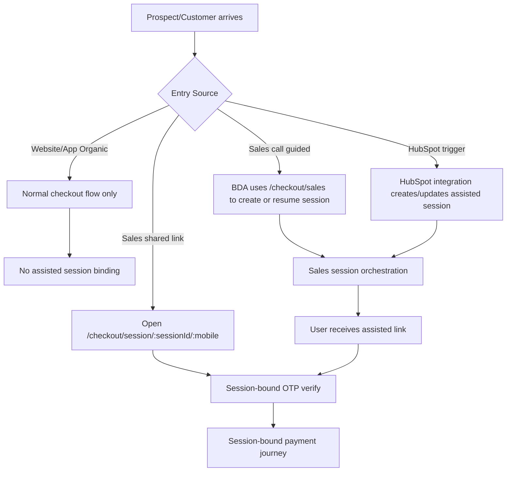

## 12.2 Current World vs Target World (Painpoint Context)

```mermaid
flowchart LR
  subgraph Current
    C1[HubSpot within-threshold flow is system-tracked]
    C2[Below-threshold CMS/manual smart-hub]
    C3[Screenshot/manual confirmation mostly for off-system payments]
    C4[Delayed onboarding callback]
    C5[Manual subscription correction]
    C2 --> C3
    C3 --> C4 --> C5
  end
  subgraph Target Assisted Checkout
    T1[Unified assisted session]
    T2[OTP before payment]
    T3[Approval gate for below-threshold]
    T4[UPS tracked payment lifecycle]
    T5[Audit + timeline + supervisor visibility]
    T1 --> T2 --> T3 --> T4 --> T5
  end
  Current -->|replace manual seams| Target Assisted Checkout
```

## 12.3 New User - Full Price (No Approval)

Narrative:

- Sales can guide to direct website flow.
- Assisted session can exist for tracking, but approval is not required.
- User verifies OTP and pays.

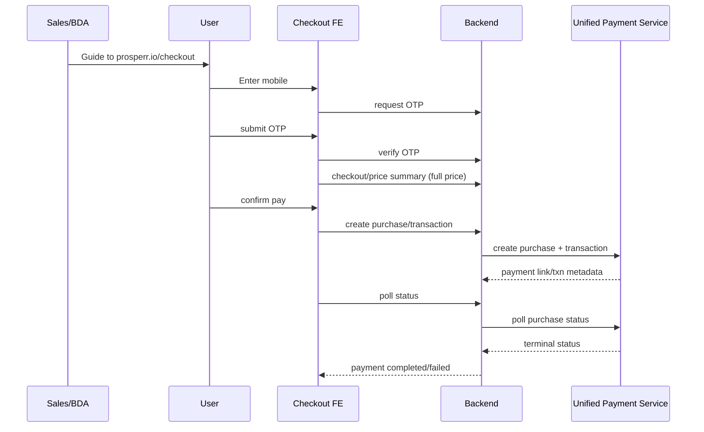

## 12.4 New User - Within Threshold (HubSpot Assisted, No Approval)

Narrative:

- HubSpot context exists (contact/deal/owner).
- BDA generates session-backed link.
- User can open direct session link or generic checkout by call guidance.

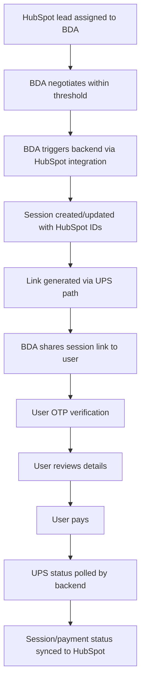

## 12.5 New User - Below Threshold (Approval Required)

Narrative:

- BDA creates session from sales portal.
- Approval required before link generation.
- Supervisor can approve; timeout branch supports draft or self-approval.
- Rejection must be explicit with reason.

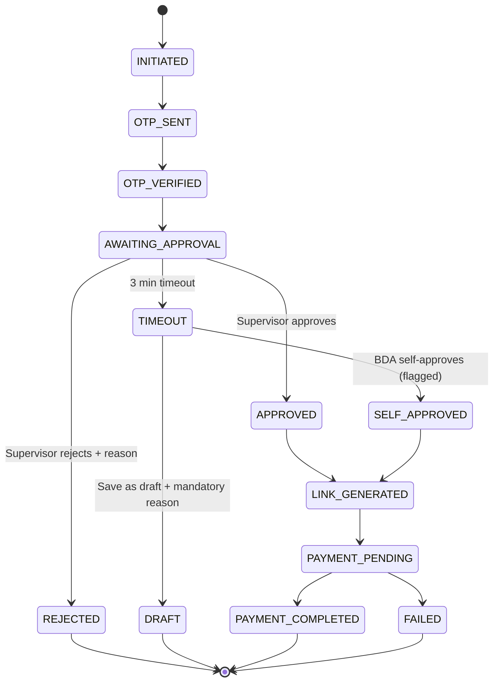

## 12.6 Supervisor Approval Queue Flow

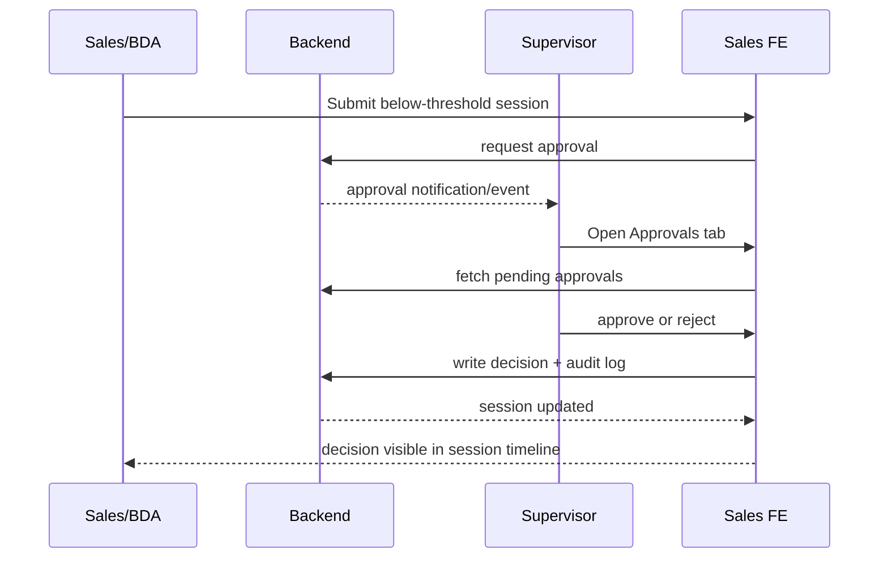

## 12.7 Timeout + Self-Approval Governance Flow

```mermaid
flowchart TD
  A[Session waiting approval] --> B{Approved within SLA?}
  B -->|Yes| C[Generate payment link event #1]
  B -->|No (timeout)| D[Show timeout modal to BDA]
  D --> E{BDA choice}
  E -->|Save Draft| F[Status DRAFT, reason mandatory]
  F --> F1[User sees: session saved as draft by sales rep]
  F1 --> F2[User action: contact sales rep or raise support ticket]
  E -->|Self-Approve| G[Status SELF_APPROVED flagged]
  G --> H[Generate payment link event #1]
  H --> H1{Link expires or user asks new link?}
  H1 -->|Yes| H2[Generate payment link event #2/#N]
  H1 -->|No| I[Wait for payment]
  H2 --> I
  I --> J[Record compliance/audit marker]
```

## 12.8 Existing Customer Detection During "New Session"

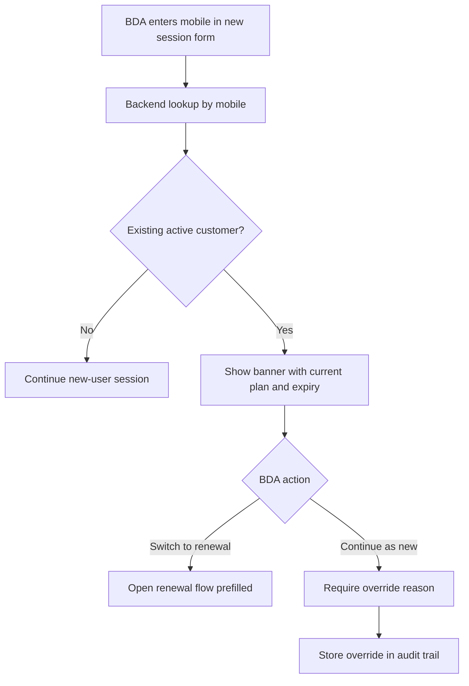

## 12.9 Renewal - Lead from HubSpot

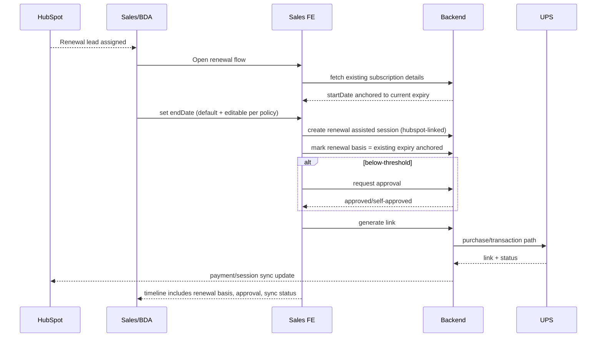

## 12.10 Renewal - Non-HubSpot (Cron-Driven Assignment)

Improvement requirement:

- Replace manual script dependence with backend cron jobs and in-portal renewal queue.
- Queue should support:
  - expiring today,
  - expiring this week,
  - expiring this month.
- Initial assignment can be CMS-driven to sales reps.
- This is temporary bridge until mandate-based renewal rollout.

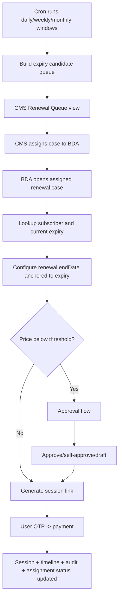

## 12.11 User-Side OTP + Payment Journey (All Assisted Variants)

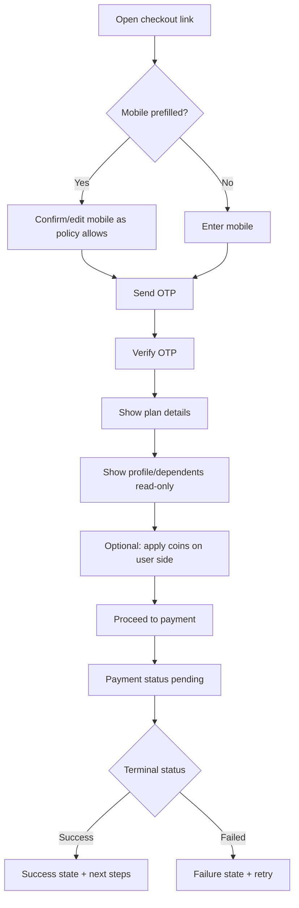

## 12.12 Dependent/Family Add-on Journey (Planned)

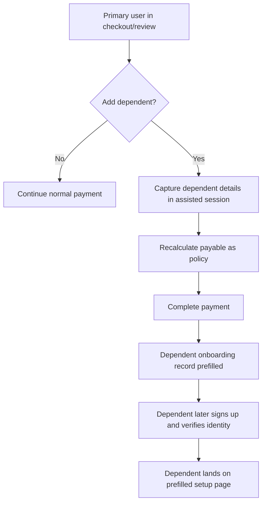

## 12.13 Session Link Sharing Options

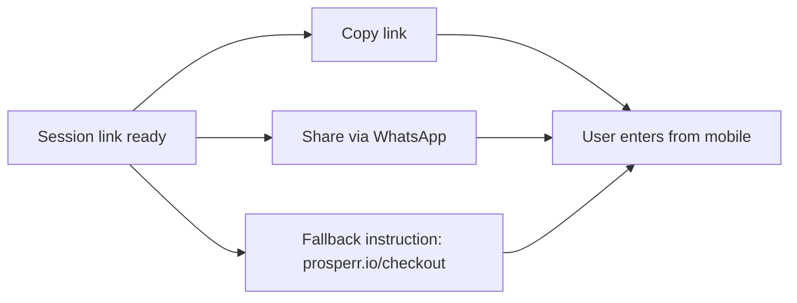

## 12.14 Payment Status Update Topology (Current)

Detail notes:

- Product-service behavior is poll-driven against UPS status.
- UPS tracks gateway status and returns purchase/transaction state.
- Session timeline should capture each visible transition.
- HubSpot-linked sessions push status updates outward after backend receives terminal/payment updates.

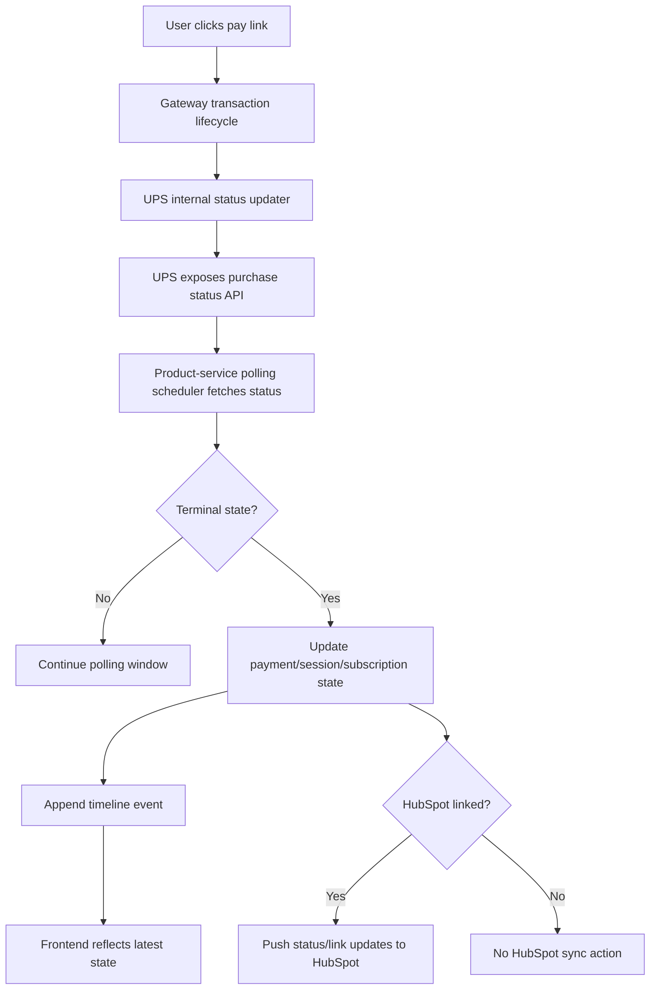

## 12.15 HubSpot Sync State Flow

Detail notes:

- Sync should not be assumed permanent-success; retry loops and error reasons are required.
- For linked sessions, minimum sync payload should include status, amount, and latest payment link metadata.

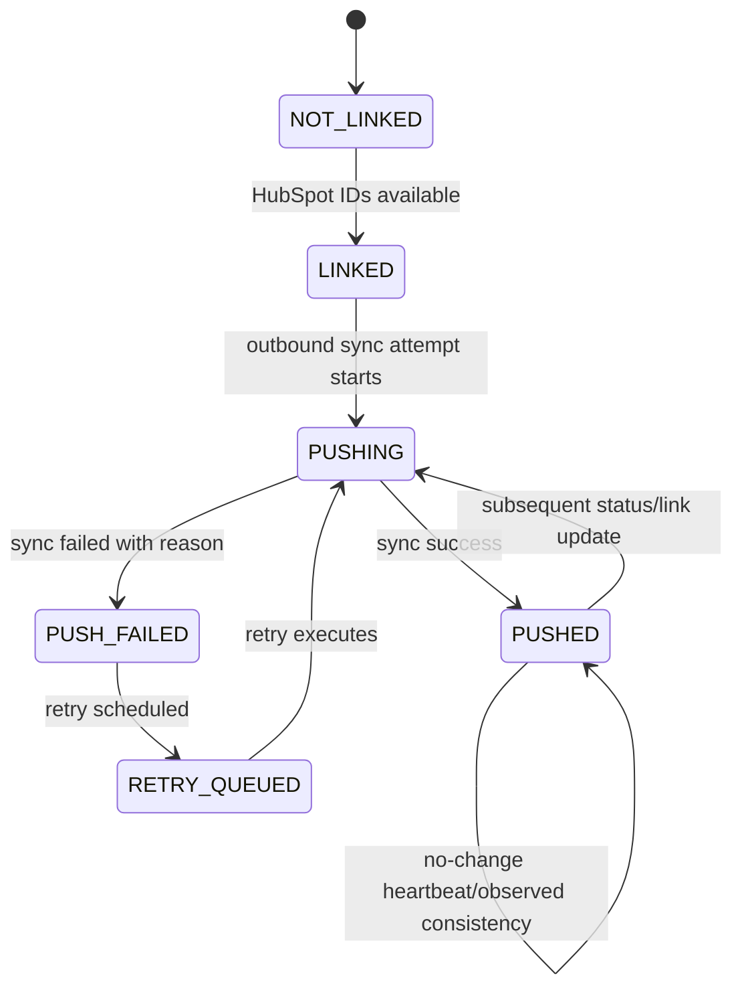

## 12.16 Role-Based Portal Behavior (BDA vs Supervisor)

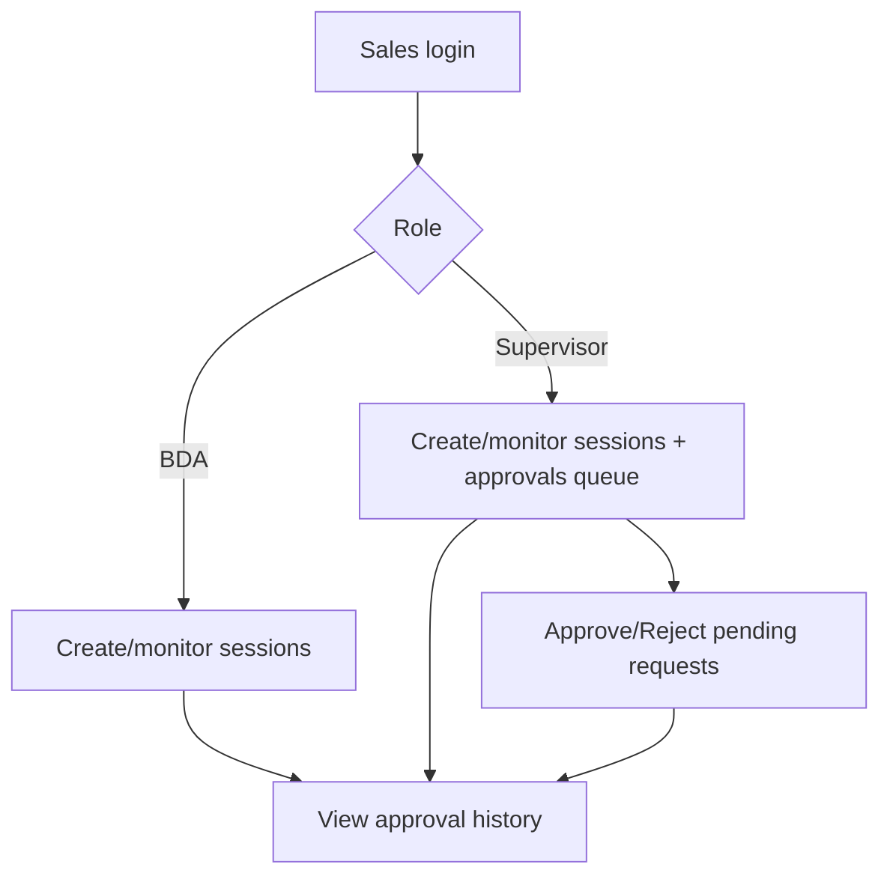

## 12.17 Session Expiry + Resume Behavior

Detail notes:

- Default session active window: 24 hours from creation.
- Draft or expired visibility must include reason messaging.
- User should know whether to wait, contact BDA, or raise support.

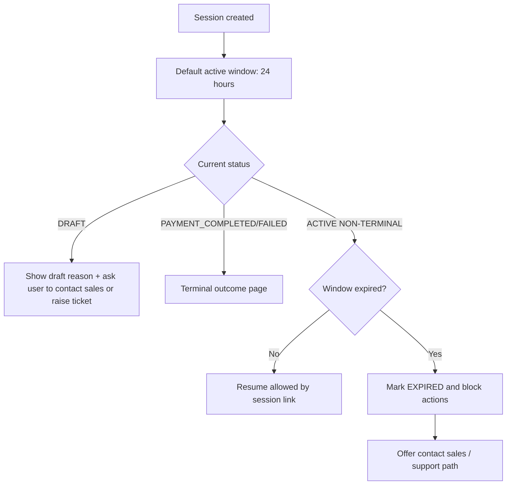

## 12.18 Data and Audit Capture Across All Flows

Mandatory event capture points:

- Session created (source + actor + role)
- OTP sent and verified
- Existing-customer lookup outcome
- Override reason when continuing new flow despite active customer
- Approval requested + notified recipients
- Supervisor decision (approve/reject) with actor
- Timeout branch decision (draft/self-approve)
- Link generated and shared channels
- Payment status transitions
- HubSpot sync transitions
- Session closure reason (completed/failed/expired/draft)
- Draft reason text (mandatory for save-as-draft)
- Link generation event counter (`link_v1`, `link_v2`, ...)
- Link regeneration trigger source (expiry/user-request/system-refresh)
- Assignment events for renewal queue (cron candidate, CMS assigned, BDA accepted)
- User-facing message events (draft-shown/expired-shown/escalation shown)
- HubSpot sync payload snapshot and failure reason codes
- Approval rejection reason payload (if rejected)

Recommended audit dimensions per event:

- `sessionId`
- `eventType`
- `actorType` (USER/BDA/SUPERVISOR/SYSTEM/CRON)
- `actorId`
- `sourceChannel` (WEBSITE/HUBSPOT/SALES_PORTAL/CRON)
- `previousStatus`
- `newStatus`
- `metadata` (JSON: amounts, thresholds, link version, reason text)
- `createdAt`

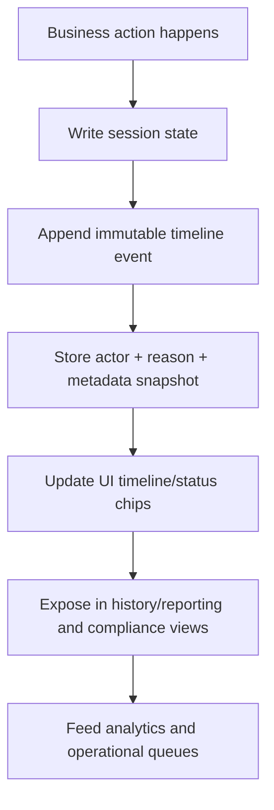

## 12.19 Canonical Flow Index (Quick Reference)

| Flow ID | Flow Name | Entry | Approval | Payment | HubSpot |
|---|---|---|---|---|---|
| F-01 | New user full price | Website / guided | No | User direct | Optional |
| F-02 | New user within threshold | HubSpot/sales | No | Assisted tracked | Yes/Optional |
| F-03 | New user below threshold | Sales portal | Yes | Assisted tracked | Optional |
| F-04 | Renewal with HubSpot lead | HubSpot/sales | Conditional | Assisted tracked | Yes |
| F-05 | Renewal without HubSpot lead | Sales portal | Conditional | Assisted tracked | Optional |
| F-06 | Timeout self-approval | Sales portal | Self-approved | Assisted tracked | Optional |
| F-07 | Draft abandon/hold | Sales portal | N/A | Not started | Optional |
| F-08 | Dependent add-on (planned) | User assisted | Conditional by price | Assisted tracked | Optional |

## 12.20 Implementation Note

When implementing frontend/backend tasks, always tag each task against one or more `Flow ID`s from `12.19`.
This keeps design, API, and QA coverage traceable and prevents missing edge paths.
